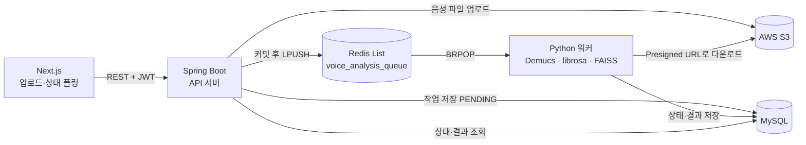

# MyVoicePick

사용자의 노래 녹음에서 보컬 특징을 뽑아, 미리 분석해 둔 노래들과 비교해 어울리는 곡을 추천하는 서비스입니다.

- **개발 형태:** 1인 개인 프로젝트 (2026.04 – 2026.05)
- **핵심 과제:** 보컬 분리·음성 분석처럼 무거운 작업을 웹 요청에서 떼어내 비동기로 처리하기
- **구성:** Next.js 클라이언트 · Spring Boot API 서버 · Python 분석 워커

## 배포 사이트

https://my-voice-pick.vercel.app/


## 시스템 구조



1. 클라이언트가 녹음 파일을 올리면 API 서버가 S3에 저장하고 분석 작업(`PENDING`)을 DB에 기록합니다.
2. API 서버는 **202 Accepted**와 작업 ID를 바로 돌려줍니다. 분석이 끝날 때까지 요청을 붙잡지 않습니다.
3. DB 커밋이 끝난 뒤 Redis 큐에 작업을 넣고, Python 워커가 꺼내 보컬 분리(Demucs)와 특징 추출(Pitch, MFCC)을 수행합니다.
4. 워커가 결과를 DB에 쓰면, 클라이언트는 작업 ID로 상태를 폴링해 결과를 받습니다.

## 기술 스택

| 영역 | 기술 |
| --- | --- |
| API 서버 | Java 17, Spring Boot 4.0, Spring Data JPA, Spring Security (OAuth2 로그인, JWT) |
| 분석 워커 | Python, Demucs(htdemucs), librosa, FAISS, SQLAlchemy |
| 데이터 | MySQL, Redis (작업 큐) |
| 인프라·연동 | AWS S3 (Presigned URL), 토스페이먼츠 |
| 클라이언트 | Next.js, TypeScript |

## 주요 설계와 트러블슈팅

### 1. DB 커밋 전에 워커가 작업을 읽는 문제

**문제:** 작업 저장(`save`) 직후 같은 트랜잭션 안에서 Redis에 발행하면, 커밋 전에 워커가 메시지를 받아 DB를 조회합니다. 이때 "작업 없음"이 발생했습니다.

**해결:** `TransactionSynchronizationManager.registerSynchronization()`의 `afterCommit()`에서 발행하도록 바꿨습니다. 커밋이 끝난 작업만 워커에게 전달됩니다. 발행 자체가 실패하면 작업을 `FAILED`로 바꿉니다.

→ `AnalysisService.requestAnalysis()`

### 2. 무거운 분석과 웹 요청 분리

보컬 분리와 특징 추출은 CPU를 많이 쓰고 오래 걸립니다. API 서버는 작업을 접수만 하고 응답합니다. 분석은 Redis 큐를 소비하는 워커가 순서대로 처리합니다. 워커 수를 늘려 처리량을 조절할 수 있습니다.

### 3. 파일 접근 보안

S3 버킷은 공개하지 않습니다. 워커에게는 유효 시간이 짧은 Presigned URL만 전달합니다. 업로드 파일은 `FileValidator`로 확장자(mp3, wav, m4a)와 MIME 타입을 검사합니다.

## 알고 있는 한계와 개선 계획

| 한계 | 개선 방향 |
| --- | --- |
| 커밋 후 Redis 발행이 실패하면 작업이 `PENDING`에 남을 수 있음 | 오래된 `PENDING` 작업을 스케줄러가 다시 발행 |
| 워커가 `BRPOP`으로 꺼낸 뒤 비정상 종료되면 메시지가 사라짐 | `LMOVE` 처리 중 목록 또는 Redis Streams ACK 사용 |
| Presigned URL(10분)보다 대기열이 길면 다운로드 시점에 만료됨 | 메시지에는 S3 키만 담고, 워커가 처리 시작 시 접근 |
| 결제 승인 시 금액을 클라이언트 요청 값으로 사용 | 주문 생성 시 서버가 금액을 확정하고 승인 시 대조 |

## 로컬 실행

### 준비 사항

- JDK 17, Python 3.10+, Node.js 18+
- MySQL, Redis 실행 중
- FFmpeg (워커의 오디오 전처리에 필요)
- AWS S3 버킷과 접근 키
- 소셜 로그인(Google·Naver·Kakao), 토스페이먼츠 테스트 키 (해당 기능 사용 시)

### 1. API 서버

`src/main/resources/application.yml.template`을 복사해 `application.yml`을 만들고 값을 채웁니다. `application.yml`은 Git에 올라가지 않습니다.

필요한 설정 키:

- `spring.datasource.*`, `spring.data.redis.*`
- `spring.security.oauth2.client.registration.{google,naver,kakao}.*`
- `spring.jwt.secret`, `spring.jwt.expiration-time`
- `spring.cloud.aws.credentials.*`, `spring.cloud.aws.region.static`, `spring.cloud.aws.s3.bucket`
- `toss.payment.secret-key`, `app.frontend-url`

```bash
./gradlew bootRun
```

### 2. 분석 워커

`ai-worker/.env`를 만들고 아래 키를 채웁니다.

```env
REDIS_HOST=localhost
REDIS_PORT=6379
REDIS_QUEUE_NAME=voice_analysis_queue
DATABASE_URL=mysql+pymysql://<user>:<password>@localhost:3306/voicepick_db
AWS_ACCESS_KEY_ID=
AWS_SECRET_ACCESS_KEY=
AWS_DEFAULT_REGION=
AWS_S3_BUCKET=
```

```bash
cd ai-worker
pip install -r requirements.txt
python main.py
```

추천 기준이 되는 곡 데이터는 `data_collector.py`로 미리 구축합니다.

### 3. 클라이언트

`myvoicepick-client/.env.local`에 `NEXT_PUBLIC_TOSS_CLIENT_KEY`를 설정합니다.

```bash
cd myvoicepick-client
npm install
npm run dev
```

## API

| 메서드 | 경로 | 설명 |
| --- | --- | --- |
| POST | `/api/v1/analyze` | 음성 파일 업로드, 분석 요청 (202 + taskId) |
| GET | `/api/v1/analyze/{taskId}/status` | 분석 상태·결과 조회 |
| GET | `/api/v1/analyze/my-latest` | 내 최신 분석 결과 |
| GET | `/api/v1/analyze/my-history` | 내 분석 이력 |
| DELETE | `/api/v1/analyze/{taskId}` | 내 분석 이력 삭제 |
